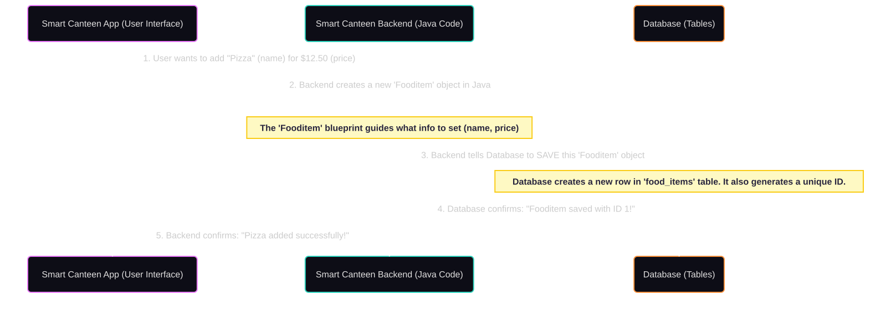
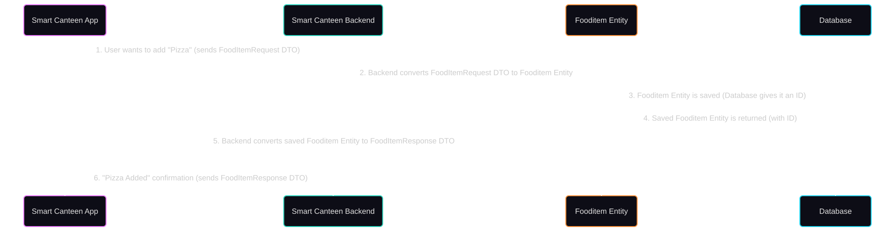
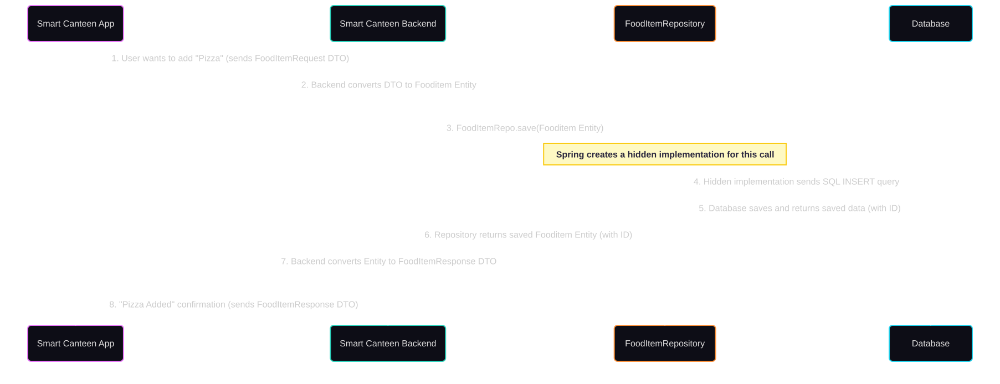
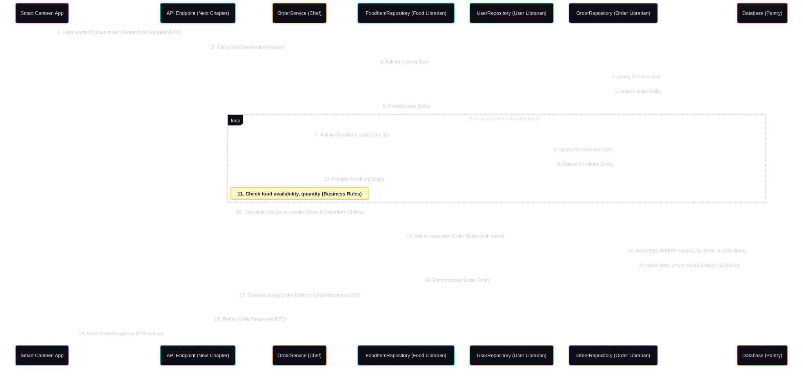
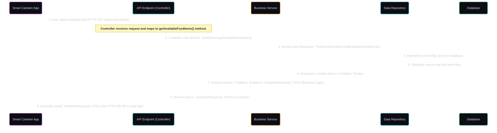
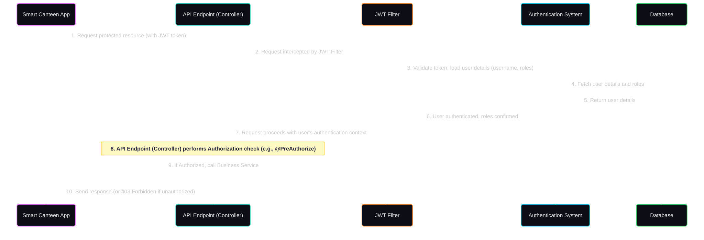

# smart-canteen-backend

The `smart-canteen-backend` project is a robust backend system designed to manage a modern canteen's operations. It securely handles **food item management**, **order placement and tracking**, and **payment processing**. Users can register, log in, and perform actions based on their roles, such as *students* ordering food, *canteen managers* updating menu items, and *NGOs* receiving donated food, all while ensuring data integrity and secure access.


## Visual Overview


## Chapters

1. [Data Models (Entities)
](01_data_models__entities__.md)
2. [Data Transfer Objects (DTOs)
](02_data_transfer_objects__dtos__.md)
3. [Data Repositories
](03_data_repositories_.md)
4. [Business Services
](04_business_services_.md)
5. [API Endpoints (Controllers)
](05_api_endpoints__controllers__.md)
6. [Security Configuration
](06_security_configuration_.md)

---
# Chapter 1: Data Models (Entities)

Welcome to the first chapter of our Smart Canteen Backend tutorial! If you're new to backend development, don't worry – we'll take it one step at a time.

### What Problem Are We Solving?

Imagine our Smart Canteen system. It needs to keep track of a lot of information:
*   What food items are available? (e.g., Pizza, Burger, Salad)
*   Who are the users of the system? (e.g., John, Jane, Admin)
*   What orders have been placed? (e.g., John ordered a Pizza)
*   What payments have been made?

How do we organize all this information so that our computer program can store it, find it later, and make sense of it? This is exactly where "Data Models" come in!

**Think of Data Models as the blueprints or templates for all the information our canteen system needs to store.** Just like a builder uses blueprints to construct a house, our software uses data models to construct and manage the data.

### What are Data Models (Entities)?

In programming, when we talk about a "Data Model" that represents something concrete in the real world (like a `Fooditem` or an `Order`), we often call it an **Entity**.

An **Entity** is a plain Java class (a "blueprint") that represents a table in our database. It defines:
1.  **What kind of information** it holds (e.g., a food item has a name, a price). These are called **fields** or **attributes**.
2.  **How different pieces of information are connected** (e.g., an order belongs to a specific user). These are called **relationships**.

Let's look at a concrete example: How does our canteen system know what a "Food Item" is and store it?

### The `Fooditem` Entity: Our First Blueprint

Here's a simplified version of the `Fooditem` entity from our project:

```java
// File: src/main/java/com/smartcanteen/model/Fooditem.java
package com.smartcanteen.model;

import jakarta.persistence.*; // Important for database mapping
import lombok.Data; // A helper tool for simpler code

import java.math.BigDecimal; // For precise prices

@Entity // 1. This tells Java: "This class is a database blueprint!"
@Table(name = "food_items") // 2. This specifies the name of the table in the database
@Data // 3. This is a helper from 'Lombok' that automatically adds code like get/set methods
public class Fooditem {

    @Id // 4. This field is the unique identifier for each food item
    @GeneratedValue(strategy = GenerationType.IDENTITY) // 5. The database will automatically generate a new ID
    private Long id; // Example: 1, 2, 3...

    @Column(nullable = false, unique = true) // 6. This food item MUST have a name, and each name must be different
    private String name; // Example: "Pizza", "Burger"

    private String description; // Example: "Delicious pepperoni pizza"

    @Column(nullable = false) // 7. This food item MUST have a price
    private BigDecimal price; // Example: 12.50, 8.00

    // ... other fields like 'availableToday' are here too
}
```

**Explanation of the Code:**

*   **`@Entity`**: This is a very important tag (annotation) from a technology called JPA (Java Persistence API). It tells our application, "Hey, this `Fooditem` class is not just any class; it's a blueprint for data that will be stored in a database."
*   **`@Table(name = "food_items")`**: This annotation tells the system that when we save `Fooditem` objects, they should go into a database table named `food_items`.
*   **`@Data`**: This is from a library called Lombok. It's a shortcut! Instead of us writing `public String getName() { return name; }` and `public void setName(String name) { this.name = name; }` for every field, `@Data` automatically generates these methods for us. Very handy!
*   **`@Id`**: Every unique item in our database needs a unique identifier. `@Id` marks the `id` field as this unique key.
*   **`@GeneratedValue(strategy = GenerationType.IDENTITY)`**: This tells the database to automatically create a new, unique `id` for each new food item we add. We don't have to think about it!
*   **`@Column(...)`**: This annotation is used for specific settings for a database column. For `name`, we specify `nullable = false` (meaning it *cannot* be empty) and `unique = true` (meaning no two food items can have the same name).

### Other Important Canteen Blueprints

Our Smart Canteen system uses several other entities to organize its data:

*   **`User`**: The blueprint for people who use the system (customers, staff).
    *   Fields: `id`, `username`, `email`, `password`, `role`.
    *   Relationships: A `User` can place many `Order`s.
*   **`Order`**: The blueprint for a customer's order.
    *   Fields: `id`, `totalPrice`, `status` (like PENDING, COMPLETED).
    *   Relationships: An `Order` is placed by one `User`, and it contains many `OrderItem`s.
*   **`OrderItem`**: The blueprint for a specific item *within* an order.
    *   Fields: `id`, `quantity` (how many), `priceAtOrder` (what the price was when ordered).
    *   Relationships: An `OrderItem` belongs to one `Order` and refers to one `Fooditem`.
*   **`Payment`**: The blueprint for a payment made for an order.
    *   Fields: `id`, `amount`, `status` (PAID, FAILED), `paymentMethod`.
    *   Relationships: A `Payment` is linked to one `User` and one `Order`.
*   **`Role`**: The blueprint for different types of users (e.g., ADMIN, CUSTOMER).
    *   Fields: `id`, `name` (e.g., `ERole.ADMIN`).
    *   Relationships: A `User` has one `Role`.

### How Data Models (Entities) Work Behind the Scenes

When you create a `Fooditem` object in your Java code, how does it actually get saved into a database?

The `@Entity` and other annotations we saw earlier act like instructions. When you tell our application to "save this `Fooditem`," it uses these instructions to:

1.  **Understand the structure**: It knows a `Fooditem` needs an `id`, `name`, `price`, etc.
2.  **Translate to database language**: It converts your Java object into a language the database understands (SQL queries, specifically INSERT statements).
3.  **Store the data**: It sends this information to the database, which then stores it in the `food_items` table, following the `Fooditem` blueprint.

Here's a simple flow:



### Code Examples - Diving Deeper into Relationships

Let's look at how relationships are defined using our `Order` entity as an example.

```java
// File: src/main/java/com/smartcanteen/model/Order.java
package com.smartcanteen.model;

import com.smartcanteen.security.User; // To link to a User
import jakarta.persistence.*; // Important for database mapping
import lombok.Data; // Helper for simple code

import java.math.BigDecimal;
import java.util.ArrayList;
import java.util.List;

@Entity
@Table(name = "orders")
@Data
public class Order {

    @Id
    @GeneratedValue(strategy = GenerationType.IDENTITY)
    private Long id;

    // --- Relationship 1: Order to User ---
    @ManyToOne(fetch = FetchType.LAZY) // 1. Many orders can belong to ONE user
    @JoinColumn(name = "user_id", nullable = false) // 2. This links to the 'id' column in the 'users' table
    private User user; // This field holds a reference to the User who placed this order

    @Column(name = "total_price", nullable = false, precision = 10, scale = 2)
    private BigDecimal totalPrice;

    // --- Relationship 2: Order to OrderItem ---
    @OneToMany(mappedBy = "order", cascade = CascadeType.ALL, orphanRemoval = true, fetch = FetchType.LAZY)
    private List<OrderItem> orderItems = new ArrayList<>(); // 3. One order can have MANY individual items (like 2 pizzas, 1 burger)

    // Helper method to add items to an order
    public void addOrderItem(OrderItem orderItem) {
        orderItems.add(orderItem);
        orderItem.setOrder(this); // Very important: links the order item back to this order
    }
}
```

**Explanation of Relationships:**

*   **`@ManyToOne`**: This annotation on the `user` field in the `Order` class means "many `Order`s can be associated with one `User`."
    *   `fetch = FetchType.LAZY`: This is a performance setting. It means "don't load the `User` details immediately unless specifically asked for." This saves memory if we only need the order's details, not the user's.
    *   `@JoinColumn(name = "user_id")`: This tells the database that the `orders` table will have a column named `user_id`, which will store the `id` of the `User` who placed the order.
*   **`@OneToMany`**: This annotation on the `orderItems` list in the `Order` class means "one `Order` can have many `OrderItem`s."
    *   `mappedBy = "order"`: This tells JPA that the `OrderItem` class has a field named `order` that manages this relationship. It avoids duplicating information in the database.
    *   `cascade = CascadeType.ALL`: This is powerful! It means that if we save an `Order`, all its `OrderItem`s will also be saved automatically. If we delete an `Order`, its `OrderItem`s will also be deleted.

These relationships allow our different data models to be linked together, forming a complete picture of our canteen's operations.

### Conclusion

In this chapter, we learned that **Data Models (Entities)** are the fundamental blueprints for structuring and storing all the important information in our Smart Canteen backend. They define what information belongs to a `Fooditem`, an `Order`, or a `User`, and how these pieces of information are connected through relationships. Understanding these entities is the first crucial step in building any robust backend application.

Now that we know how data is *stored* in our database using entities, how do we efficiently move and present this data within our application and to other parts of the system (like the user interface)? That's where [Data Transfer Objects (DTOs)](02_data_transfer_objects__dtos__.md) come in!

---
# Chapter 2: Data Transfer Objects (DTOs)

Welcome back to our Smart Canteen Backend tutorial! In [Chapter 1: Data Models (Entities)](01_data_models__entities__.md), we learned how to create "blueprints" for our data, like `Fooditem` or `Order`, so our application knows how to store information in a database. These blueprints contain *all* the details needed for storage.

But now, imagine this: you've got a detailed blueprint for a house. If you just want to *tell* someone about the house, do you give them the full, highly technical blueprint with every pipe and wire? Probably not! You'd give them a simpler summary: "It's a 3-bedroom, 2-bathroom house with a garden."

### What Problem Are We Solving?

Our Smart Canteen system needs to talk a lot:
*   The frontend (like a mobile app or website) needs to *send* information to the backend (e.g., "Add a new Pizza!").
*   The backend needs to *send* information back to the frontend (e.g., "Here's the list of all available food items.").

When this communication happens, we often **don't need all the details** that are stored in our [Data Models (Entities)](01_data_models__entities__.md).
For example:
*   When you **add a new `Fooditem`**, the frontend doesn't know its unique `id` yet (because the database generates it). It just needs to send the `name`, `description`, and `price`.
*   When you **list `User`s**, the backend definitely **should NOT send the user's `password`** to the frontend, even though it's stored in the `User` entity for security.
*   Sometimes, we might even combine information from multiple entities into one message for the frontend.

Sending too much unnecessary information, or sensitive information, is bad for performance and security. This is where **Data Transfer Objects (DTOs)** come in!

### What are Data Transfer Objects (DTOs)?

**Think of DTOs as standardized forms or menus for communication.**
Instead of directly sending our detailed [Data Models (Entities)](01_data_models__entities__.md) (which are tied to our database structure), DTOs define exactly what information is expected when you send something, or what will be sent back when you receive something.

They are simple Java classes, just like our entities, but their **only job is to carry data between different parts of our application**, especially between the frontend and the backend.

### Two Main Types of DTOs

To manage data flow, we usually create two types of DTOs for each major piece of information:

1.  **Request DTOs**: These are used when the frontend (or another part of the system) wants to **send information *to* our backend**.
    *   They contain only the fields needed for the backend to perform an action.
    *   Example: `FoodItemRequest` when someone wants to add a new food item.

2.  **Response DTOs**: These are used when our backend wants to **send information *back to* the frontend**.
    *   They contain only the fields the frontend needs to display or process.
    *   They might hide sensitive fields or combine data from multiple sources.
    *   Example: `FoodItemResponse` when the frontend asks for details about a food item.

Let's look at our `Fooditem` example again.

### The `FoodItemRequest` DTO: Sending Data In

When the Smart Canteen app wants to add a new food item, it doesn't need to send an `id` because the database will create one. It just needs the basics:

```java
// File: src/main/java/com/smartcanteen/dto/FoodItemRequest.java
package com.smartcanteen.dto;

import lombok.Data; // Our helpful Lombok tool
import java.math.BigDecimal; // For precise prices

@Data // Generates getters and setters for us
public class FoodItemRequest {
    private String name;        // Example: "Pizza"
    private String description; // Example: "Delicious cheesy pizza"
    private BigDecimal price;   // Example: 12.50
    private Boolean isAvailable; // Is it available today?
}
```

**Explanation:**
*   This `FoodItemRequest` is a simple form. When the frontend sends a request to add a food item, it fills out this "form" with the `name`, `description`, `price`, and `isAvailable`.
*   Notice there's no `id` field. The frontend doesn't generate the `id`; the database does that later!
*   Also, no `donatedAt` or `receivedByNgoAt` fields because these are internal timestamps generated by the backend, not something the frontend sends.

### The `FoodItemResponse` DTO: Sending Data Out

After a food item is added (or when the frontend asks to see existing food items), the backend sends information back. This `FoodItemResponse` is designed for that:

```java
// File: src/main/java/com/smartcanteen/dto/FoodItemResponse.java
package com.smartcanteen.dto;

import lombok.Data;
import java.math.BigDecimal;
import java.time.LocalDateTime; // To include timestamps

@Data
public class FoodItemResponse {
    private Long id; // Now the ID is included!
    private String name;
    private String description;
    private BigDecimal price;
    private boolean availableToday;
    private LocalDateTime donatedAt;
    private LocalDateTime receivedByNgoAt; // Useful timestamp for frontend
}
```

**Explanation:**
*   This `FoodItemResponse` is what the frontend *receives*.
*   It now includes the `id` (which was generated by the database) and useful timestamps like `donatedAt` and `receivedByNgoAt` that the frontend might want to display.
*   It still keeps the information relevant to the frontend, without exposing *all* possible internal database fields.

### Other Important Canteen DTOs

Our Smart Canteen system uses DTOs for almost all communication:

*   **`OrderRequest`**: Used when a user places an order. It contains a list of `OrderItemRequest`s.
*   **`OrderResponse`**: Sent back when an order is created or viewed. It includes the `id`, `totalPrice`, `status`, and `OrderItemResponse`s.
*   **`UserResponse`**: Used to send user details to the frontend (but **without the password!**).
*   **`LoginRequest` / `RegisterRequest` / `JwtResponse`**: Used specifically for user login and registration to handle credentials and authentication tokens.

Each DTO is tailored to its specific purpose (sending or receiving) and contains only the necessary information.

### How Data Transfer Objects (DTOs) Work Behind the Scenes

Let's trace how DTOs help when you add a "Pizza" to the canteen menu.

**Imagine you fill out a simple "Add Food Item" form on the Smart Canteen website:**

1.  **Frontend Creates a `FoodItemRequest`**: The website gathers the `name` ("Pizza"), `description`, `price`, and `isAvailable` you typed. It packages this information into a `FoodItemRequest` DTO object.
2.  **Frontend Sends Request**: This `FoodItemRequest` DTO is sent over the internet to our backend system.
3.  **Backend Receives `FoodItemRequest`**: The backend gets the `FoodItemRequest` DTO. It then "unpacks" this DTO to get the raw `name`, `description`, etc.
4.  **Backend Creates an [Entity](01_data_models__entities__.md)**: Using the data from the DTO, the backend creates a `Fooditem` [entity](01_data_models__entities__.md) object. This `Fooditem` entity is the detailed blueprint, ready to be saved in the database.
5.  **Backend Saves the [Entity](01_data_models__entities__.md)**: The backend saves this `Fooditem` [entity](01_data_models__entities__.md) to the database. The database then generates a unique `id` for our new Pizza.
6.  **Backend Creates a `FoodItemResponse`**: After saving, the backend takes the newly saved `Fooditem` [entity](01_data_models__entities__.md) (which now has an `id` and timestamps!) and converts it into a `FoodItemResponse` DTO. This DTO is specifically designed for the frontend.
7.  **Backend Sends Response**: The `FoodItemResponse` DTO is sent back to the frontend.
8.  **Frontend Displays Success**: The frontend receives the `FoodItemResponse` and uses the `id`, `name`, and other details to show a "Pizza added successfully!" message.

Here's a simplified flow:



**How does the "conversion" (Step 2 and 5) happen in code?**

You won't typically write these conversions directly inside your DTO files. Instead, other parts of the backend (which we'll learn about in later chapters, like [Business Services](04_business_services_.md) or [API Endpoints (Controllers)](05_api_endpoints__controllers__.md)) handle this. For now, think of it as a logical step:

```java
// CONCEPTUAL EXAMPLE: How data flows, not actual file content
// Imagine this happens inside a 'service' that handles logic

// Step 1 & 3: Receiving the request DTO
FoodItemRequest requestFromFrontend = new FoodItemRequest();
requestFromFrontend.setName("Pizza");
requestFromFrontend.setPrice(new BigDecimal("12.50"));
requestFromFrontend.setIsAvailable(true);

// Step 2: Convert Request DTO to Entity
Fooditem newFooditemEntity = new Fooditem();
newFooditemEntity.setName(requestFromFrontend.getName());
newFooditemEntity.setPrice(requestFromFrontend.getPrice());
newFooditemEntity.setAvailableToday(requestFromFrontend.getIsAvailable());
// Description and other fields would be set similarly

// Step 3 & 4: Save Entity to Database (handled by Repositories, Chapter 3)
// Fooditem savedFooditem = fooditemRepository.save(newFooditemEntity);
// Let's assume after saving, 'savedFooditem' has an ID and timestamps
Fooditem savedFooditem = new Fooditem(); // Dummy for example
savedFooditem.setId(1L);
savedFooditem.setName("Pizza");
savedFooditem.setPrice(new BigDecimal("12.50"));
savedFooditem.setAvailableToday(true);
savedFooditem.setDonatedAt(LocalDateTime.now());

// Step 5: Convert Entity to Response DTO
FoodItemResponse responseToFrontend = new FoodItemResponse();
responseToFrontend.setId(savedFooditem.getId());
responseToFrontend.setName(savedFooditem.getName());
responseToFrontend.setPrice(savedFooditem.getPrice());
responseToFrontend.setAvailableToday(savedFooditem.isAvailableToday());
responseToFrontend.setDonatedAt(savedFooditem.getDonatedAt());
// Set other fields, potentially calculated or from other entities

// Step 6: Send Response DTO back to frontend
// return responseToFrontend;
```

This "conversion" process is crucial for making DTOs useful. It allows us to control exactly what data goes in and out of our backend.

### DTOs vs. Entities: A Quick Comparison

It's important to understand the difference between DTOs and [Entities](01_data_models__entities__.md):

| Feature         | Data Model (Entity)                                | Data Transfer Object (DTO)                         |
| :-------------- | :------------------------------------------------- | :------------------------------------------------- |
| **Purpose**     | **Stores** data in the database (blueprint for tables) | **Transfers** data between systems (communication forms) |
| **Fields**      | Contains **all** fields for database storage, including internal IDs and relationships | Contains **only necessary** fields for a specific communication (request or response) |
| **Database Link** | Directly mapped to a database table              | **No direct link** to the database                 |
| **Used By**     | Backend's internal data logic, database persistence | Frontend and Backend for sending/receiving data    |
| **Example**     | `Fooditem` (with `id`, `name`, `description`, `price`, `donatedAt`, etc.) | `FoodItemRequest` (just `name`, `description`, `price`), `FoodItemResponse` (subset of entity fields + `id`) |

### Conclusion

In this chapter, we learned that **Data Transfer Objects (DTOs)** are essential tools for clean and efficient communication in our Smart Canteen backend. They act like standardized forms, allowing us to define exactly what information flows into and out of our system, hiding internal database complexities and ensuring security.

Now that we know how our data is modeled ([Entities](01_data_models__entities__.md)) and how it travels between systems (DTOs), the next logical step is to understand how our application actually **saves** these entities to the database and **fetches** them back. That's precisely what we'll explore in [Chapter 3: Data Repositories](03_data_repositories_.md)!

---

# Chapter 3: Data Repositories

Welcome back to the Smart Canteen Backend tutorial! In [Chapter 1: Data Models (Entities)](01_data_models__entities__.md), we learned how to design the "blueprints" for our data (like `Fooditem` or `Order`). Then, in [Chapter 2: Data Transfer Objects (DTOs)](02_data_transfer_objects__dtos__.md), we saw how to create "forms" for cleanly sending data into and out of our system.

Now, we have these beautiful data blueprints, but how do we actually tell our computer program to **store them in a database**? Or, how do we ask the database to **give us all the pizzas** or **find a specific order**?

### What Problem Are We Solving?

Imagine our Smart Canteen system needs to do things like:
*   "Save this new food item: 'Spaghetti', price $9.99."
*   "Show me all the food items currently available."
*   "Delete the old 'Burger' item from the menu."
*   "Find the order placed by user 'John' last Tuesday."

Directly talking to a database using a language called SQL (Structured Query Language) can be complicated. It involves setting up connections, writing specific commands for saving or fetching data, and handling potential errors. Doing this for every single piece of data interaction would be a lot of repetitive work!

**Think of Data Repositories as dedicated librarians for your database.**
When our system needs to fetch a food item, save a new order, or find a user, it doesn't try to dig through the database shelves itself. Instead, it asks the corresponding "librarian."

Each repository (librarian) specializes in one type of data (e.g., `FoodItemRepository` for food items, `OrderRepository` for orders), providing standard operations like "find all," "save this new record," or "delete that record." They abstract away the complex database interactions, making our code much cleaner and easier to understand.

### What are Data Repositories?

In our Smart Canteen backend, **Data Repositories are interfaces (like contracts)** that define how we interact with our database for a specific [Data Model (Entity)](01_data_models__entities__.md).

The amazing part? We usually **don't write the actual code** that connects to the database and performs these operations! A powerful tool called **Spring Data JPA** (which is part of our Spring Boot framework) does it for us automatically. We just define *what* we want to do, and Spring Data JPA takes care of *how* it's done.

### The `FoodItemRepository`: Our Food Librarian

Let's look at the `FoodItemRepository` from our project:

```java
// File: src/main/java/com/smartcanteen/repository/FoodItemRepository.java
package com.smartcanteen.repository;

import com.smartcanteen.model.Fooditem;
import org.springframework.data.jpa.repository.JpaRepository; // The magic comes from here
import org.springframework.stereotype.Repository;

import java.util.List;
import java.util.Optional;

@Repository // 1. Tells Spring this is a data repository
public interface FoodItemRepository extends JpaRepository<Fooditem, Long> {

    // 2. Custom method: Check if a food item name already exists
    boolean existsByName(String name);

    // 3. Custom method: Find a food item by its name
    Optional<Fooditem> findByName(String name);

    // 4. Custom method: Find all food items that are available today
    List<Fooditem> findByAvailableTodayTrue();
}
```

**Explanation of the Code:**

1.  **`@Repository`**: This annotation tells Spring that this interface is a "repository" component, meaning it handles data storage and retrieval. Spring will then manage it properly.
2.  **`public interface FoodItemRepository extends JpaRepository<Fooditem, Long>`**: This is the core magic!
    *   We define an `interface` (a contract) named `FoodItemRepository`.
    *   It `extends JpaRepository`. This is the crucial part. `JpaRepository` is a powerful interface provided by Spring Data JPA. When we extend it, our `FoodItemRepository` automatically inherits a bunch of common database operations!
    *   `<Fooditem, Long>`: These are two important pieces of information we give to `JpaRepository`:
        *   `Fooditem`: This tells the repository *which* [Entity](01_data_models__entities__.md) it's responsible for managing (our `Fooditem` blueprint).
        *   `Long`: This tells the repository the *type* of the unique ID for `Fooditem` (in our `Fooditem` entity, the `id` field is `Long`).

### What Methods Do We Get for Free?

Because `FoodItemRepository` extends `JpaRepository`, we automatically get powerful methods without writing a single line of implementation!

*   **`save(Fooditem entity)`**: To create a new food item or update an existing one.
*   **`findById(Long id)`**: To find a food item by its unique ID. It returns an `Optional<Fooditem>`, which means the item might or might not be found (it's a safe way to handle cases where the ID doesn't exist).
*   **`findAll()`**: To get a list of all food items.
*   **`deleteById(Long id)`**: To remove a food item by its ID.
*   **`count()`**: To get the total number of food items.

And many more! These are the standard "librarian" operations.

### How Do We Get Custom Methods? (Spring Data Magic)

Look at the custom methods in `FoodItemRepository` again:

```java
// From FoodItemRepository.java
boolean existsByName(String name);
Optional<Fooditem> findByName(String name);
List<Fooditem> findByAvailableTodayTrue();
```

We didn't write any code for these either! This is another amazing feature of Spring Data JPA: **derived query methods**.

*   Spring Data JPA looks at the method names (e.g., `findByName`, `findByAvailableTodayTrue`).
*   It then intelligently *derives* (figures out) what database query to run based on the method name and the fields in our `Fooditem` [entity](01_data_models__entities__.md).
*   For example, `findByName(String name)` translates to: "Find a `Fooditem` where its `name` field matches the `name` provided."
*   `findByAvailableTodayTrue()` translates to: "Find all `Fooditem`s where the `availableToday` field is `true`."

This saves us a huge amount of time and prevents errors because we don't have to write complex SQL queries ourselves.

### Solving a Use Case: Adding a New Food Item

Let's revisit our example of adding a new food item ("Pizza"). We've learned about [Entities](01_data_models__entities__.md) and [DTOs](02_data_transfer_objects__dtos__.md). Now, let's see where the `FoodItemRepository` fits in.

Imagine the user wants to add "Pizza" from the Smart Canteen app:

1.  **Frontend**: Creates a `FoodItemRequest` [DTO](02_data_transfer_objects__dtos__.md) with `name="Pizza"`, `price=12.50`, etc. and sends it to the backend.
2.  **Backend (later in [Business Services](04_business_services_.md))**: Receives the `FoodItemRequest` [DTO](02_data_transfer_objects__dtos__.md).
3.  **Backend (later in [Business Services](04_business_services_.md))**: Converts the `FoodItemRequest` [DTO](02_data_transfer_objects__dtos__.md) into a `Fooditem` [Entity](01_data_models__entities__.md). At this point, the `Fooditem` entity does *not* have an `id` yet.
4.  **Backend (using the Repository)**: Asks the `FoodItemRepository` to `save()` this new `Fooditem` entity.
    ```java
    // CONCEPTUAL EXAMPLE: This happens inside a 'Service' class (Chapter 4)
    // You would 'inject' the repository into your service class
    // FoodItemRepository foodItemRepository; // This would be provided by Spring

    // Step 4: Use the repository to save the entity
    Fooditem pizzaEntity = new Fooditem(); // This entity was created from the DTO
    pizzaEntity.setName("Pizza");
    pizzaEntity.setPrice(new BigDecimal("12.50"));
    // ... set other fields

    Fooditem savedPizzaEntity = foodItemRepository.save(pizzaEntity);
    // After this line, savedPizzaEntity will have the ID generated by the database!
    System.out.println("Pizza saved with ID: " + savedPizzaEntity.getId());
    ```
5.  **Database**: Receives the request from the repository, stores the "Pizza" data in the `food_items` table, and generates a unique `id` for it.
6.  **Repository**: Returns the saved `Fooditem` [Entity](01_data_models__entities__.md) (now with its `id`) back to the backend code.
7.  **Backend (later in [Business Services](04_business_services_.md))**: Converts the saved `Fooditem` [Entity](01_data_models__entities__.md) into a `FoodItemResponse` [DTO](02_data_transfer_objects__dtos__.md) (which now includes the `id`).
8.  **Backend**: Sends the `FoodItemResponse` [DTO](02_data_transfer_objects__dtos__.md) back to the frontend.

### How Data Repositories Work Behind the Scenes

Here’s a simplified flow of how a "save" operation works:



**What is the "hidden implementation"?**
When your application starts, Spring Data JPA automatically inspects all your `JpaRepository` interfaces. For each one, it **dynamically creates a real Java class** that implements all the methods (like `save`, `findById`, `deleteById`, and your custom `findByName`). This generated class contains the actual code to connect to the database, translate your method calls into SQL queries, execute them, and convert the results back into Java objects. You never see this generated code, but it's working hard for you!

### Other Important Canteen Repositories

Our Smart Canteen backend uses several other repositories, each responsible for its own [Entity](01_data_models__entities__.md):

*   **`OrderRepository`**: Manages `Order` [entities](01_data_models__entities__.md).
    ```java
    // File: src/main/java/com/smartcanteen/repository/OrderRepository.java
    public interface OrderRepository extends JpaRepository<Order, Long> {
        List<Order> findByUser(User user); // Find orders by the user
        // ... other methods
    }
    ```
*   **`UserRepository`**: Manages `User` [entities](01_data_models__entities__.md).
    ```java
    // File: src/main/java/com/smartcanteen/repository/UserRepository.java
    public interface UserRepository extends JpaRepository<User, Long> {
        Optional<User> findByUsername(String username); // Find user by username
        Boolean existsByEmail(String email); // Check if email exists
        // ... other methods
    }
    ```
*   **`OrderItemRepository`**: Manages `OrderItem` [entities](01_data_models__entities__.md).
*   **`PaymentRepository`**: Manages `Payment` [entities](01_data_models__entities__.md).
*   **`RoleRepository`**: Manages `Role` [entities](01_data_models__entities__.md).

Each one follows the same pattern: it's an `interface` that `extends JpaRepository` for a specific [Entity](01_data_models__entities__.md) and its ID type, potentially adding custom "derived query methods" as needed.

### Repositories vs. Entities: A Quick Comparison

It's helpful to compare what we've learned so far:

| Feature           | Data Model (Entity)                                | Data Transfer Object (DTO)                         | Data Repository                              |
| :---------------- | :------------------------------------------------- | :------------------------------------------------- | :------------------------------------------- |
| **Purpose**       | **Blueprint** for data stored in the database      | **Forms** for sending/receiving data              | **Librarian** for database interaction       |
| **What it is**    | A plain Java class with `@Entity`                  | A plain Java class, no special Spring annotations  | A Java `interface` extending `JpaRepository` |
| **Database Link** | Directly mapped to a database table                | No direct link                                     | Handles all database interactions            |
| **Fields/Methods**| Defines data fields and relationships              | Defines fields for communication payloads          | Defines methods for CRUD (Create, Read, Update, Delete) operations |
| **Used By**       | Backend's internal data logic, database persistence | Frontend and Backend for data exchange             | Backend services to talk to the database     |
| **Example**       | `Fooditem` class                                   | `FoodItemRequest`, `FoodItemResponse`              | `FoodItemRepository`                         |

### Conclusion

In this chapter, we discovered that **Data Repositories** are incredibly powerful tools that simplify how our Smart Canteen backend interacts with the database. By extending `JpaRepository` and using Spring Data JPA's "magic" (derived query methods), we can perform complex database operations with very little code. Repositories act as the crucial bridge between our Java objects ([Entities](01_data_models__entities__.md)) and the actual database.

Now that we understand how data is modeled, transferred, and stored, the next logical step is to learn about the "brains" of our application: the code that contains the actual business rules and uses these repositories to perform tasks. That's what we'll explore in [Chapter 4: Business Services](04_business_services_.md)!

---

# Chapter 4: Business Services

Welcome back to our Smart Canteen Backend tutorial! In [Chapter 1: Data Models (Entities)](01_data_models__entities__.md), we designed the "blueprints" for our data. In [Chapter 2: Data Transfer Objects (DTOs)](02_data_transfer_objects__dtos__.md), we learned how to create "forms" for smooth data communication. And in [Chapter 3: Data Repositories](03_data_repositories_.md), we found our "librarians" that handle saving and fetching data from the database.

Now, imagine you have all these pieces: ingredients (data entities), recipe cards (DTOs), and pantry organizers (repositories). What's missing? The actual **chef** who takes the order, checks ingredients, follows the recipe, cooks the dish, and serves it!

### What Problem Are We Solving?

Our Smart Canteen system isn't just about storing data; it needs to *do* things. For example, when a customer wants to "place an order":
*   We need to know *who* is placing the order.
*   We need to check if the food items they want are *actually available*.
*   We need to calculate the *total price*.
*   We need to save the order details, linking it to the user and the food items.
*   If something goes wrong (e.g., food is out of stock), the whole process should be canceled.

This is more than just saving a single piece of data. It's a **complex operation** that involves multiple steps, checks, and interactions with different parts of our system (like looking up food items and saving orders). This is precisely the job of **Business Services**.

**Think of Business Services as the expert chefs in our canteen.** They take raw ingredients ([data from repositories](03_data_repositories_.md)), apply recipes ([business rules](03_data_repositories_.md)), and prepare the final dishes (complex operations).

### What are Business Services?

In our Smart Canteen backend, **Business Services (often simply called "Services")** are dedicated Java classes that contain the "brains" or "business logic" of our application. They are where the actual work happens.

Their main responsibilities include:
*   **Orchestrating Operations**: They coordinate multiple steps to complete a task (e.g., placing an order involves checking food, calculating price, then saving).
*   **Applying Business Rules**: They enforce rules like "a food item must be available to be ordered" or "a user cannot delete their own account if they are the last admin."
*   **Managing Transactions**: They ensure that a series of database operations either *all succeed* or *all fail together*. This is crucial for keeping our data consistent (e.g., an order and its items are saved together, or none are).
*   **Converting Data**: They convert [Request DTOs](02_data_transfer_objects__dtos__.md) received from the outside into [Entities](01_data_models__entities__.md) for saving, and then convert saved [Entities](01_data_models__entities__.md) back into [Response DTOs](02_data_transfer_objects__dtos__.md) to send back.

Services typically interact with [Data Repositories](03_data_repositories_.md) to get and save [Entities](01_data_models__entities__.md). They also perform validation and apply business-specific logic that doesn't belong in the simpler [Repositories](03_data_repositories_.md) or [Entities](01_data_models__entities__.md) themselves.

### The `OrderService`: Our Master Chef for Orders

Let's look at a simplified `OrderService` to understand how it works. This service is responsible for handling everything related to customer orders.

```java
// File: src/main/java/com/smartcanteen/service/OrderService.java
package com.smartcanteen.service;

import com.smartcanteen.exception.ResourceNotFoundException;
import com.smartcanteen.model.Fooditem;
import com.smartcanteen.model.Order;
import com.smartcanteen.model.OrderItem;
import com.smartcanteen.login.enity.EOrderStatus; // Order status enum
import com.smartcanteen.dto.OrderRequest;
import com.smartcanteen.dto.OrderItemRequest;
import com.smartcanteen.dto.OrderResponse;
import com.smartcanteen.dto.OrderItemResponse;
import com.smartcanteen.repository.FoodItemRepository;
import com.smartcanteen.repository.OrderItemRepository;
import com.smartcanteen.repository.OrderRepository;
import com.smartcanteen.repository.UserRepository;
import com.smartcanteen.security.User; // User Entity

import jakarta.transaction.Transactional; // Important for atomicity
import org.springframework.stereotype.Service;

import java.math.BigDecimal;
import java.util.List;
import java.util.stream.Collectors;

@Service // 1. Tells Spring this is a Service component
public class OrderService {

    // 2. Services need access to Repositories
    private final OrderRepository orderRepository;
    private final OrderItemRepository orderItemRepository;
    private final FoodItemRepository foodItemRepository;
    private final UserRepository userRepository;

    // 3. Spring automatically provides these (Dependency Injection)
    public OrderService(OrderRepository orderRepository,
                        OrderItemRepository orderItemRepository,
                        FoodItemRepository foodItemRepository,
                        UserRepository userRepository) {
        this.orderRepository = orderRepository;
        this.orderItemRepository = orderItemRepository;
        this.foodItemRepository = foodItemRepository;
        this.userRepository = userRepository;
    }

    // Helper method to convert an Order Entity to an OrderResponse DTO
    private OrderResponse mapToOrderResponse(Order order) {
        List<OrderItemResponse> itemResponses = order.getOrderItems().stream()
                .map(item -> new OrderItemResponse(
                        item.getId(),
                        item.getFoodItem().getId(),
                        item.getFoodItem().getName(),
                        item.getPriceAtOrder(),
                        item.getQuantity(),
                        item.getSubtotal()
                ))
                .collect(Collectors.toList());

        return new OrderResponse(
                order.getId(),
                order.getUser().getId(),
                order.getUser().getUsername(),
                order.getTotalPrice(),
                order.getStatus(),
                itemResponses
        );
    }

    // ... other helper methods like getCurrentUserId() would be here
    // (We saw this in the full code snippet but simplify for tutorial)

    /**
     * Places a new order for the currently authenticated user.
     * This is where the complex business logic lives!
     * @param orderRequest The DTO containing the list of food items and quantities.
     * @return The created OrderResponse DTO.
     */
    @Transactional // 4. Ensures all database operations within this method either succeed or fail together
    public OrderResponse placeOrder(OrderRequest orderRequest) {
        // Long currentUserId = getCurrentUserId(); // Get current user (from a helper method)
        User currentUser = userRepository.findById(1L) // Simplified: Assume user 1 for now
            .orElseThrow(() -> new ResourceNotFoundException("User not found."));

        // 5. Initialize order and total price
        BigDecimal totalOrderPrice = BigDecimal.ZERO;
        Order newOrder = new Order();
        newOrder.setUser(currentUser);
        newOrder.setStatus(EOrderStatus.PENDING); // Initial status is PENDING

        if (orderRequest.getItems() == null || orderRequest.getItems().isEmpty()) {
            throw new IllegalArgumentException("Order must contain at least one item.");
        }

        // 6. Loop through each item in the request, apply rules, and create OrderItems
        for (OrderItemRequest itemRequest : orderRequest.getItems()) {
            Fooditem foodItem = foodItemRepository.findById(itemRequest.getFoodItemId())
                    .orElseThrow(() -> new ResourceNotFoundException("Food item not found with id: " + itemRequest.getFoodItemId()));

            if (!foodItem.isAvailableToday()) { // Business Rule 1: Check availability
                throw new IllegalArgumentException("Food item '" + foodItem.getName() + "' is currently not available.");
            }
            if (itemRequest.getQuantity() <= 0) { // Business Rule 2: Quantity must be positive
                throw new IllegalArgumentException("Quantity for '" + foodItem.getName() + "' must be positive.");
            }

            BigDecimal itemSubtotal = foodItem.getPrice().multiply(BigDecimal.valueOf(itemRequest.getQuantity()));

            OrderItem orderItem = new OrderItem(); // Create OrderItem Entity
            orderItem.setFoodItem(foodItem);
            orderItem.setQuantity(itemRequest.getQuantity());
            orderItem.setPriceAtOrder(foodItem.getPrice()); // Record price at time of order
            orderItem.setSubtotal(itemSubtotal);

            newOrder.addOrderItem(orderItem); // Add item to order
            totalOrderPrice = totalOrderPrice.add(itemSubtotal); // Sum up total price
        }

        newOrder.setTotalPrice(totalOrderPrice); // Set final total price

        // 7. Save the entire order (and its items due to cascading in Order entity)
        Order savedOrder = orderRepository.save(newOrder);

        // 8. Convert the saved Order Entity to an OrderResponse DTO
        return mapToOrderResponse(savedOrder);
    }
    // ... other methods like getAllOrders(), updateOrderStatus(), etc. would be here
}
```

**Explanation of the Code:**

1.  **`@Service`**: This annotation tells Spring, "This `OrderService` class is a service component, and Spring should manage it." Spring will then be able to automatically provide an instance of this service wherever it's needed.
2.  **Repository Dependencies**: Notice how `OrderService` has `private final` fields for `OrderRepository`, `FoodItemRepository`, `UserRepository`, and `OrderItemRepository`. These are the "librarians" that the `OrderService` needs to talk to the database.
3.  **Constructor (Dependency Injection)**: The `public OrderService(...)` block is a special constructor. Spring automatically detects that `OrderService` needs these repositories and **injects** (provides) them when it creates an `OrderService` object. You don't have to create them yourself!
4.  **`@Transactional`**: This is a powerful Spring annotation. It means: "Treat all database operations inside this method (`placeOrder`) as a single, atomic unit." If any part of the `placeOrder` method fails (e.g., an error occurs while saving food items), then **all** changes made to the database by this method will be rolled back (undone). This ensures your data remains consistent.
5.  **Initialization**: The service starts by creating a new `Order` [entity](01_data_models__entities__.md) and setting its initial status to `PENDING`. It also retrieves the `User` who is placing the order.
6.  **Business Logic Loop**: The core of `placeOrder` is a loop that goes through each item the user wants to order (`OrderItemRequest` [DTOs](02_data_transfer_objects__dtos__.md)). For each item:
    *   It uses `foodItemRepository.findById()` to fetch the `Fooditem` [entity](01_data_models__entities__.md) from the database.
    *   It applies **business rules**: `if (!foodItem.isAvailableToday())` ensures we only allow ordering of available items. `if (itemRequest.getQuantity() <= 0)` ensures a valid quantity.
    *   It calculates the subtotal for each item.
    *   It creates an `OrderItem` [entity](01_data_models__entities__.md) for each, linking it to the `Fooditem`.
    *   It adds the `OrderItem` to the `newOrder` and updates the `totalOrderPrice`.
7.  **Saving the Order**: Finally, `orderRepository.save(newOrder)` is called. Thanks to the relationships defined in our [Order entity](01_data_models__entities__.md) ([Chapter 1](01_data_models__entities__.md)), saving the `Order` automatically saves all its associated `OrderItem`s too!
8.  **Converting to Response DTO**: The `mapToOrderResponse` helper method takes the `Order` [entity](01_data_models__entities__.md) (which now has an `id` and all its `OrderItem`s with their `id`s) and converts it into a clean `OrderResponse` [DTO](02_data_transfer_objects__dtos__.md) to be sent back to the frontend.

### How Business Services Work Behind the Scenes (Placing an Order)

Let's trace how the `placeOrder` method within our `OrderService` orchestrates the process:



As you can see, the `OrderService` acts as the central coordinator, pulling information from different [repositories](03_data_repositories_.md), applying rules, and putting everything together before sending the final data back. The `@Transactional` annotation ensures that steps 3-17 are treated as one single, unbreakable operation.

### Other Important Canteen Business Services

Just like `OrderService` manages orders, other services manage their specific parts of the Smart Canteen system:

| Service Name        | What it does (Examples of Business Logic)                                       |
| :------------------ | :------------------------------------------------------------------------------ |
| **`FoodService`**   | - Create/Update `Fooditem` (e.g., ensure name is unique, validate price).       |
|                     | - Toggle food availability (e.g., if unavailable, cannot be ordered).           |
|                     | - Mark food as `donated` or `received by NGO` (specific timestamps & status).   |
| **`PaymentService`**| - Process payments (e.g., ensure payment amount matches order total).           |
|                     | - Check if an order is already paid or cancelled before processing payment.     |
|                     | - Update payment status (e.g., COMPLETED, REFUNDED).                           |
| **`UserService`**   | - Manage user roles (e.g., prevent deleting the last ADMIN user).               |
|                     | - Update user information (e.g., validate email format).                        |
|                     | - Handle user registration and login (more complex, often involves `AuthService`).|

Each service encapsulates the specific rules and processes for its domain, making the code modular and easier to maintain.

### Services vs. Other Layers: A Quick Comparison

Let's update our comparison table to include Business Services:

| Feature           | Data Model (Entity)                                | Data Transfer Object (DTO)                         | Data Repository                              | Business Service                                 |
| :---------------- | :------------------------------------------------- | :------------------------------------------------- | :------------------------------------------- | :----------------------------------------------- |
| **Purpose**       | **Blueprint** for data stored in the database      | **Forms** for sending/receiving data              | **Librarian** for database interaction       | **Chef/Brain** for business logic and operations |
| **What it is**    | A plain Java class with `@Entity`                  | A plain Java class, no special Spring annotations  | A Java `interface` extending `JpaRepository` | A Java class with `@Service`                 |
| **Database Link** | Directly mapped to a database table                | No direct link                                     | Handles all database interactions            | Uses [Repositories](03_data_repositories_.md) to interact with DB |
| **Fields/Methods**| Defines data fields and relationships              | Defines fields for communication payloads          | Defines methods for CRUD operations          | Orchestrates logic, applies rules, manages transactions |
| **Used By**       | Backend's internal data logic, database persistence | Frontend and Backend for data exchange             | Business Services to talk to the database    | [API Endpoints](05_api_endpoints__controllers__.md) to perform complex tasks |
| **Example**       | `Fooditem` class                                   | `FoodItemRequest`, `FoodItemResponse`              | `FoodItemRepository`                         | `OrderService`, `FoodService`                    |

### Conclusion

In this chapter, we learned that **Business Services** are the core "brain" of our Smart Canteen backend. They are responsible for implementing the complex business rules, coordinating multiple database operations using [Repositories](03_data_repositories_.md), and ensuring data consistency through transactions. By organizing our logic into services, we make our application robust, maintainable, and easy to understand.

Now that we know how our business logic is structured, how do we make these services available to the outside world, like our Smart Canteen mobile app or website? That's what we'll cover in [Chapter 5: API Endpoints (Controllers)](05_api_endpoints__controllers__.md)!

---
# Chapter 5: API Endpoints (Controllers)

Welcome back to our Smart Canteen Backend tutorial! So far, we've built a solid foundation:
*   In [Chapter 1: Data Models (Entities)](01_data_models__entities__.md), we learned how to design the "blueprints" for our data (like `Fooditem` or `Order`).
*   In [Chapter 2: Data Transfer Objects (DTOs)](02_data_transfer_objects__dtos__.md), we created "forms" for neatly sending data around.
*   In [Chapter 3: Data Repositories](03_data_repositories_.md), we found our "librarians" that handle saving and fetching data from the database.
*   And in [Chapter 4: Business Services](04_business_services_.md), we set up the "expert chefs" that contain the main business logic and use our repositories to perform complex tasks.

Now, imagine our Smart Canteen has a fully functional kitchen with chefs, ingredients, and organizers. But how do customers (like a student using the mobile app or a manager on the website) actually *place an order* or *see what food is available*? They can't directly walk into the kitchen!

### What Problem Are We Solving?

Our backend application needs a way to **listen for requests** from the outside world (like a mobile app or a website) and **send back responses**.
*   How does the mobile app tell our backend: "Hey, show me all available food items"?
*   How does it send: "I want to place an order for Pizza and a Burger"?
*   How does our backend know where to receive these requests and what to do with them?

This is exactly where **API Endpoints (Controllers)** come in!

**Think of API Endpoints (Controllers) as the canteen's reception desk.** When a student or manager sends a request (e.g., "show me all available food" or "place an order"), the **Controller** receives it. It then figures out which "chef" ([Business Service](04_business_services_.md)) can handle the request, passes it on, and finally sends the "dish" ([Response DTO](02_data_transfer_objects__dtos__.md)) back to the client.

Controllers define the specific URLs (web addresses) and HTTP methods (like GET, POST, PUT, DELETE) through which the frontend interacts with our backend.

### What are API Endpoints (Controllers)?

In our Smart Canteen backend, **Controllers** are special Java classes that:
1.  **Listen for incoming HTTP requests**: They are like the "ears" of our backend, constantly waiting for someone to talk to them through a specific URL.
2.  **Map URLs to methods**: Each method in a Controller is linked to a unique URL path (like `/api/food/available`) and an HTTP method (like `GET` for getting data, `POST` for sending new data).
3.  **Receive and send [DTOs](02_data_transfer_objects__dtos__.md)**: They typically receive [Request DTOs](02_data_transfer_objects__dtos__.md) and return [Response DTOs](02_data_transfer_objects__dtos__.md).
4.  **Delegate to [Business Services](04_business_services_.md)**: Controllers don't contain complex business logic themselves. Their main job is to receive a request, tell the appropriate [Business Service](04_business_services_.md) to do the actual work, and then return the result.
5.  **Handle HTTP Responses**: They decide what HTTP status code (like 200 OK, 201 Created, 404 Not Found) to send back, along with the data.

### The `FoodController`: Our Food Menu Receptionist

Let's look at a simplified `FoodController` to see how it works. This controller handles all requests related to `Fooditem`s.

```java
// File: src/main/java/com/smartcanteen/controller/FoodController.java
package com.smartcanteen.controller;

import com.smartcanteen.dto.FoodItemRequest; // For receiving data
import com.smartcanteen.dto.FoodItemResponse; // For sending data
import com.smartcanteen.service.FoodService; // The chef
import jakarta.validation.Valid; // For input validation
import org.springframework.http.HttpStatus;
import org.springframework.http.ResponseEntity; // To build responses
import org.springframework.security.access.prepost.PreAuthorize; // For security
import org.springframework.web.bind.annotation.*; // All mapping annotations

import java.util.List;

@RestController // 1. Tells Spring: "This class handles web requests!"
@RequestMapping("/api/food") // 2. All methods in this class start with this URL
public class FoodController {

    private final FoodService foodService; // 3. The Controller needs its chef

    public FoodController(FoodService foodService) { // 4. Spring automatically provides the chef (Dependency Injection)
        this.foodService = foodService;
    }

    /**
     * Endpoint to get a list of all available food items.
     * Accessible to Students, Managers, and Admins.
     * GET /api/food/available
     */
    @GetMapping("/available") // 5. This method handles GET requests to /api/food/available
    @PreAuthorize("hasAnyRole('ROLE_STUDENT', 'ROLE_CANTEEN_MANAGER', 'ROLE_ADMIN')") // 6. Security rule: Who can access this
    public ResponseEntity<List<FoodItemResponse>> getAvailableFoodItems() {
        // 7. Call the Service (the chef) to do the actual work
        List<FoodItemResponse> foodItems = foodService.getAvailableFoodItems();
        // 8. Return the list of food items with an "OK" status (HTTP 200)
        return ResponseEntity.ok(foodItems);
    }

    /**
     * Endpoint to create a new food item.
     * Only accessible by Canteen Managers.
     * POST /api/food/add
     */
    @PostMapping("/add") // 9. This method handles POST requests to /api/food/add
    @PreAuthorize("hasRole('ROLE_CANTEEN_MANAGER')") // Security rule
    public ResponseEntity<FoodItemResponse> createFoodItem(@Valid @RequestBody FoodItemRequest foodItemRequest) {
        // 10. Receive the FoodItemRequest DTO from the client
        // 11. Call the Service to create the food item
        FoodItemResponse newFoodItem = foodService.createFoodItem(foodItemRequest);
        // 12. Return the created food item with a "CREATED" status (HTTP 201)
        return new ResponseEntity<>(newFoodItem, HttpStatus.CREATED);
    }

    // ... other methods for updating, deleting, or getting by ID would be here
}
```

**Explanation of the Code:**

1.  **`@RestController`**: This is a special Spring annotation that marks this Java class as a "Controller" and tells Spring to automatically convert the responses into a format like JSON, which is easily understood by web browsers or mobile apps.
2.  **`@RequestMapping("/api/food")`**: This annotation on the class level defines the "base path" for all methods inside this controller. So, any URL handled by this controller will start with `/api/food`.
3.  **`private final FoodService foodService;`**: Just like our [services](04_business_services_.md) needed [repositories](03_data_repositories_.md), our controllers need access to the relevant [Business Services](04_business_services_.md) to do their work.
4.  **`public FoodController(FoodService foodService)`**: This is how Spring "injects" (provides) an instance of `FoodService` into our controller. You just declare that you need it, and Spring takes care of finding and giving it to you. This is called **Dependency Injection**.
5.  **`@GetMapping("/available")`**: This annotation maps an incoming HTTP `GET` request to the specific method `getAvailableFoodItems()`. Combined with the class-level `@RequestMapping`, the full URL this method responds to is `/api/food/available`.
6.  **`@PreAuthorize(...)`**: This is a security annotation (we'll learn more in [Chapter 6: Security Configuration](06_security_configuration_.md)). For now, just know it restricts who can access this specific endpoint (e.g., only students, managers, and admins can see available food).
7.  **`List<FoodItemResponse> foodItems = foodService.getAvailableFoodItems();`**: This is the core job of the controller: it **delegates** the actual business logic to the `foodService`. The `foodService` (our "chef") does the work, fetches the data, and returns a list of `FoodItemResponse` [DTOs](02_data_transfer_objects__dtos__.md).
8.  **`return ResponseEntity.ok(foodItems);`**: `ResponseEntity` is a powerful Spring class that allows us to fully control the HTTP response. `ResponseEntity.ok()` is a shortcut for sending an HTTP status code of `200 OK` along with the `foodItems` data.
9.  **`@PostMapping("/add")`**: This maps an incoming HTTP `POST` request to the `createFoodItem()` method. The full URL is `/api/food/add`. `POST` is typically used for creating new resources.
10. **`@RequestBody FoodItemRequest foodItemRequest`**: This annotation tells Spring to take the data sent in the "body" of the incoming HTTP request (which will be a [FoodItemRequest DTO](02_data_transfer_objects__dtos__.md) in JSON format) and automatically convert it into a `FoodItemRequest` Java object.
11. **`@Valid`**: This annotation works with our [DTOs](02_data_transfer_objects__dtos__.md) to ensure that the incoming data meets certain rules (e.g., a field isn't empty). If the data doesn't pass validation, Spring automatically sends an error response.
12. **`return new ResponseEntity<>(newFoodItem, HttpStatus.CREATED);`**: This sends back the newly created `FoodItemResponse` [DTO](02_data_transfer_objects__dtos__.md) along with an HTTP `201 Created` status code, which is standard for successful creation.

### Example Interaction: Getting Available Food

Let's trace what happens when a student's mobile app asks for available food:

**Input (from mobile app/browser):**
A `GET` request to the URL: `http://localhost:8080/api/food/available`

**Expected Output (to mobile app/browser):**
An HTTP `200 OK` status code and a list of food items in JSON format, like this:
```json
[
    {
        "id": 1,
        "name": "Pizza",
        "description": "Delicious cheesy pizza",
        "price": 12.50,
        "availableToday": true,
        "donatedAt": null,
        "receivedByNgoAt": null
    },
    {
        "id": 2,
        "name": "Burger",
        "description": "Classic beef burger",
        "price": 8.00,
        "availableToday": true,
        "donatedAt": null,
        "receivedByNgoAt": null
    }
]
```

### Example Interaction: Placing an Order

Now let's see how `OrderController` works when a student places an order:

**Input (from mobile app/browser):**
A `POST` request to the URL: `http://localhost:8080/api/orders/place`
With a JSON body (the [OrderRequest DTO](02_data_transfer_objects__dtos__.md)):
```json
{
    "items": [
        {"foodItemId": 1, "quantity": 1},
        {"foodItemId": 2, "quantity": 2}
    ]
}
```

**Expected Output (to mobile app/browser):**
An HTTP `201 Created` status code and the details of the newly created order in JSON format, like this:
```json
{
    "id": 101,
    "userId": 1,
    "username": "studentuser",
    "totalPrice": 28.50,
    "status": "PENDING",
    "orderItems": [
        {
            "orderItemId": 201,
            "foodItemId": 1,
            "foodItemName": "Pizza",
            "priceAtOrder": 12.50,
            "quantity": 1,
            "subtotal": 12.50
        },
        {
            "orderItemId": 202,
            "foodItemId": 2,
            "foodItemName": "Burger",
            "priceAtOrder": 8.00,
            "quantity": 2,
            "subtotal": 16.00
        }
    ]
}
```

### How API Endpoints (Controllers) Work Behind the Scenes

Let's trace the journey of a request for available food items:



As you can see, the Controller is the first point of contact. It acts as a lightweight receptionist, quickly passing the request to the correct "chef" ([Business Service](04_business_services_.md)) and then preparing the final "dish" ([Response DTO](02_data_transfer_objects__dtos__.md)) to send back. It doesn't cook; it directs and presents!

### Other Important Canteen Controllers

Our Smart Canteen backend has several other controllers, each responsible for specific areas:

| Controller Name       | Base URL             | What it does (Examples of Endpoints)                         |
| :-------------------- | :------------------- | :----------------------------------------------------------- |
| **`AuthController`**  | `/api/auth`          | Handles user login (`/login`) and registration (`/register`). This is where users get their security tokens. |
| **`OrderController`** | `/api/orders`        | Manages placing orders (`/place`), viewing personal orders (`/my`), and for managers, viewing all orders (`/all`) or updating order status (`/{orderId}/status`). |
| **`PaymentController`** | `/api/payments`      | Handles processing payments (`/process`) for orders, viewing payment history, and updating payment statuses. |
| **`UserController`**  | `/api/users`         | (Usually only for Admins) Manages user accounts, like getting all users, updating user roles, or deleting users. |

Each controller is designed to handle a specific set of related requests, making our API organized and easy to navigate.

### Controllers vs. Other Layers: A Quick Comparison

Let's update our comparison table one last time to include API Endpoints (Controllers):

| Feature           | Data Model (Entity)                                | Data Transfer Object (DTO)                         | Data Repository                              | Business Service                                 | API Endpoint (Controller)                      |
| :---------------- | :------------------------------------------------- | :------------------------------------------------- | :------------------------------------------- | :----------------------------------------------- | :--------------------------------------------- |
| **Purpose**       | **Blueprint** for data stored in the database      | **Forms** for sending/receiving data              | **Librarian** for database interaction       | **Chef/Brain** for business logic and operations | **Reception Desk** for incoming requests       |
| **What it is**    | A plain Java class with `@Entity`                  | A plain Java class, no special Spring annotations  | A Java `interface` extending `JpaRepository` | A Java class with `@Service`                 | A Java class with `@RestController`          |
| **Database Link** | Directly mapped to a database table                | No direct link                                     | Handles all database interactions            | Uses [Repositories](03_data_repositories_.md) to interact with DB | **No direct DB link**; delegates to [Services](04_business_services_.md) |
| **Fields/Methods**| Defines data fields and relationships              | Defines fields for communication payloads          | Defines methods for CRUD operations          | Orchestrates logic, applies rules, manages transactions | Defines URL paths and HTTP methods             |
| **Used By**       | Backend's internal data logic, database persistence | Frontend and Backend for data exchange             | [Business Services](04_business_services_.md) to talk to the database | [API Endpoints](05_api_endpoints__controllers__.md) to perform complex tasks | Frontend (mobile apps, web apps)               |
| **Example**       | `Fooditem` class                                   | `FoodItemRequest`, `FoodItemResponse`              | `FoodItemRepository`                         | `OrderService`, `FoodService`                    | `FoodController`, `OrderController`          |

### Conclusion

In this chapter, we learned that **API Endpoints (Controllers)** are the crucial "front desk" of our Smart Canteen backend. They are responsible for receiving incoming requests, mapping them to the correct backend operations, delegating the complex work to [Business Services](04_business_services_.md), and sending back well-structured responses. Controllers act as the bridge between our internal backend logic and the external applications (like mobile apps and websites) that interact with our system.

Now that we understand how requests flow into our system, the next critical step is to learn how we protect our canteen's operations and ensure that only authorized users can access specific features. That's what we'll explore in [Chapter 6: Security Configuration](06_security_configuration_.md)!

---
# Chapter 6: Security Configuration

Welcome to the final chapter of our Smart Canteen Backend tutorial! We've come a long way. We've learned how to design our data blueprints ([Chapter 1: Data Models (Entities)](01_data_models__entities__.md)), how to send data cleanly ([Chapter 2: Data Transfer Objects (DTOs)](02_data_transfer_objects__dtos__.md)), how to store and retrieve data from the database ([Chapter 3: Data Repositories](03_data_repositories_.md)), and how to implement the canteen's core business rules ([Chapter 4: Business Services](04_business_services_.md)). Finally, in [Chapter 5: API Endpoints (Controllers)](05_api_endpoints__controllers__.md), we learned how to open up our backend so that the mobile app or website can talk to it.

Now, imagine our Smart Canteen is fully operational. But what if anyone could just walk into the manager's office, access sensitive financial records, or change food prices? That would be chaos! We need rules to decide who can do what.

### What Problem Are We Solving?

Our Smart Canteen system handles sensitive operations and data. We need to ensure:
*   **Only registered users can access certain features.** (e.g., only logged-in users can place an order).
*   **Users can only access what they are allowed to.** (e.g., a "Student" can place orders, but only a "Canteen Manager" can add new food items or update an order's status).
*   **Sensitive data is protected.** (e.g., user passwords should never be exposed).

This is exactly where **Security Configuration** comes in!

**Think of Security Configuration as the canteen's security guard and its rulebook.** It decides who can enter the canteen (authentication), who gets a special ID badge (JWT tokens), what areas they are allowed to access (authorization based on roles like STUDENT, MANAGER, ADMIN), and uses security checkpoints (filters) to check those badges and permissions for every incoming request.

### Key Concepts of Security

Let's break down the core ideas behind security in our backend:

#### 1. Authentication: "Who are you?" (Showing Your ID)

Authentication is the process of **proving who you are**. In our Smart Canteen, this happens when a user logs in with their username and password.

*   When you visit a website and type in your username and password, you're authenticating yourself.
*   Our backend checks if the username exists and if the provided password matches the one stored (which is always securely encrypted!).
*   If they match, you're successfully authenticated.

#### 2. JWT Tokens: Your "Identity Badge"

Once you're authenticated, the server gives you a special "identity badge" called a **JWT (JSON Web Token)**.

*   **Think of it like a special wristband or ID card.** It's a string of characters that contains some basic information about you (like your username and your role).
*   This badge is signed by the server, so the server can always verify that it hasn't been tampered with.
*   **You don't need to log in again for every action.** Instead, for every future request to the backend, your mobile app or website just sends this JWT token along. This proves that you've already been authenticated.

#### 3. Authorization: "What are you allowed to do?" (Access Levels)

Authorization is the process of **deciding what you are allowed to do** based on who you are.

*   In our canteen, users have different **roles**: `STUDENT`, `CANTEEN_MANAGER`, `ADMIN`, `NGO`.
*   A `STUDENT` role might be authorized to `place orders` and `view available food`.
*   A `CANTEEN_MANAGER` might be authorized to `add new food items`, `update order statuses`, and also `view available food`.
*   The `ADMIN` role is like the canteen owner; they can do almost anything.
*   Authorization checks whether your "identity badge" (JWT) contains a role that permits the action you're trying to perform.

#### 4. Security Filters: The "Security Checkpoints"

To enforce these rules, our backend uses **security filters**.

*   **Imagine a security guard at every important door.** Before any request reaches our [API Endpoints (Controllers)](05_api_endpoints__controllers__.md) or [Business Services](04_business_services_.md), it first passes through these filters.
*   One key filter is the **JWT Authentication Filter**. It's designed to:
    *   Look for the JWT token in the incoming request.
    *   Validate the token (is it authentic? is it expired?).
    *   If valid, identify the user and their roles.
    *   Set up the security context so later parts of the application (like `@PreAuthorize` annotations on our controllers) know who the user is and what they are allowed to do.

### How it Works in Smart Canteen: A Login Example

Let's trace how a user logs in and gets their "identity badge" (JWT).

1.  **User Sends Login Request**: The user opens the Smart Canteen app, enters their username and password, and taps "Login". This sends a `POST` request to `/api/auth/login`.

2.  **`AuthController` Handles Login**: Our `AuthController` (from [Chapter 5](05_api_endpoints__controllers__.md)) is responsible for the `/api/auth/login` endpoint. It receives the username and password in a [LoginRequest DTO](02_data_transfer_objects__dtos__.md).

3.  **Authentication Manager Authenticates**: The `AuthController` passes these credentials to Spring Security's `AuthenticationManager`. This manager works with a `CustomUserDetailsService` (our user details database) and a `PasswordEncoder` (to decrypt/check password) to verify the user.

4.  **JWT Token Generated**: If authentication is successful, a `JwtTokenUtil` (our badge maker) generates a new JWT token, encoding the user's ID, username, and role into it.

5.  **Token Sent Back**: The `AuthController` sends this JWT token back to the mobile app in a [JwtResponse DTO](02_data_transfer_objects__dtos__.md). The mobile app then stores this token to use for future requests.

Here's a simplified look at the login process in `AuthController` and the `JwtTokenUtil`:

```java
// File: src/main/java/com/smartcanteen/controller/AuthController.java
// ... imports and constructor ...

@RestController
@RequestMapping("/api/auth")
public class AuthController {
    // ... dependencies (AuthenticationManager, JwtTokenUtil, etc.) ...

    @PostMapping("/login")
    public ResponseEntity<JwtResponse> authenticateUser(@Valid @RequestBody LoginRequest loginRequest) {
        // 1. Authenticate user with username/password
        Authentication authentication = authenticationManager.authenticate(
                new UsernamePasswordAuthenticationToken(loginRequest.getUsername(), loginRequest.getPassword()));

        // 2. Set authenticated user in Spring's security context
        SecurityContextHolder.getContext().setAuthentication(authentication);

        // 3. Get user details for token generation
        UserDetails userDetails = (UserDetails) authentication.getPrincipal();

        // 4. Generate JWT token
        String jwt = jwtTokenUtil.generateToken(userDetails);

        // 5. Get user's role name for the frontend response
        // User user = userRepository.findByUsername(userDetails.getUsername()).orElseThrow(...);
        // String roleNameForFrontend = user.getRole().getName().name();

        // 6. Return the JWT token and user info
        return ResponseEntity.ok(new JwtResponse(jwt, userDetails.getUsername())); // Simplified for brevity
    }
}
```
**Explanation:**
*   The `authenticateUser` method takes a `LoginRequest` (your username and password).
*   `authenticationManager.authenticate(...)` is the core Spring Security magic that verifies the credentials.
*   If successful, `jwtTokenUtil.generateToken(userDetails)` creates your JWT badge.
*   Finally, the badge is sent back to you in a `JwtResponse`.

```java
// File: src/main/java/com/smartcanteen/security/JwtTokenUtil.java
// ... imports and @Value annotations ...

@Component
public class JwtTokenUtil {
    // ... secret and expiration values from application.properties ...

    public String generateToken(UserDetails userDetails) {
        // Here, you could add custom data (claims) to the token if needed
        Map<String, Object> claims = new HashMap<>();
        // Create the token with subject (username), issue date, expiration date, and sign it
        return Jwts.builder()
                .setClaims(claims)
                .setSubject(userDetails.getUsername())
                .setIssuedAt(new Date(System.currentTimeMillis()))
                .setExpiration(new Date(System.currentTimeMillis() + expiration))
                .signWith(getSigningKey(), SignatureAlgorithm.HS256)
                .compact(); // Build and compress the token string
    }

    public Boolean isTokenValid(String token, UserDetails userDetails) {
        // 1. Extract username from the token
        final String username = getUsernameFromJwtToken(token);
        // 2. Check if username matches and token is not expired
        return (username.equals(userDetails.getUsername()) && !isTokenExpired(token));
    }
    // ... other helper methods like getUsernameFromJwtToken, isTokenExpired ...
}
```
**Explanation:**
*   `generateToken` takes `UserDetails` (which includes username and roles) and uses a `secret` key to sign the token. This signature ensures the token's authenticity. It also sets an `expiration` time.
*   `isTokenValid` helps to check if a received token is still good.

### How it Works in Smart Canteen: Accessing a Protected Area

Now, let's say a Canteen Manager wants to add a new food item, which is a protected operation.

1.  **Request with JWT**: The manager's app sends a `POST` request to `/api/food/add`, including the JWT token they received during login in the "Authorization" header.

2.  **`JwtAuthenticationFilter` Intercepts**: Before the request even reaches the `FoodController`, the `JwtAuthenticationFilter` (our security checkpoint) steps in.
    *   It extracts the JWT token from the request header.
    *   It uses `JwtTokenUtil` to validate the token's signature and expiration.
    *   It uses `CustomUserDetailsService` to load the user's details (username, roles) from the database based on the token's information.
    *   If the token is valid, it tells Spring Security *who* this user is and *what roles* they have.

3.  **Authorization Check**: Once the `JwtAuthenticationFilter` has identified the user and their roles, Spring Security (specifically, the rules defined in `SecurityConfig` and `@PreAuthorize` annotations on the `FoodController` methods) performs an authorization check.
    *   It checks if the user's roles (`CANTEEN_MANAGER` in this case) are allowed to access the `/api/food/add` endpoint.
    *   In our `FoodController`, the `createFoodItem` method has `@PreAuthorize("hasRole('ROLE_CANTEEN_MANAGER')")`. This means only users with the `ROLE_CANTEEN_MANAGER` permission can access this specific method.

4.  **Request Proceeds or Fails**:
    *   **If Authorized**: The request proceeds to the `FoodController`'s `createFoodItem` method, and the food item is added.
    *   **If Unauthorized**: If, for example, a `STUDENT` tries to access `/api/food/add`, Spring Security will immediately stop the request and return an error (usually an HTTP `403 Forbidden` status). If no valid token is provided at all, it might be an HTTP `401 Unauthorized`.

Here are simplified code snippets for the filter and the main security configuration:

```java
// File: src/main/java/com/smartcanteen/security/JwtAuthenticationFilter.java
// ... imports ...

@Component
public class JwtAuthenticationFilter extends OncePerRequestFilter {
    // ... dependencies (JwtTokenUtil, CustomUserDetailsService) ...

    @Override
    protected void doFilterInternal(HttpServletRequest request, HttpServletResponse response, FilterChain filterChain)
            throws ServletException, IOException {
        final String authHeader = request.getHeader("Authorization"); // 1. Get Authorization header

        if (authHeader == null || !authHeader.startsWith("Bearer ")) {
            filterChain.doFilter(request, response); // No JWT or invalid format, continue
            return;
        }

        final String jwt = authHeader.substring(7); // 2. Extract JWT token
        final String username = jwtTokenUtil.getUsernameFromJwtToken(jwt); // 3. Get username from token

        if (username != null && SecurityContextHolder.getContext().getAuthentication() == null) {
            UserDetails userDetails = this.customUserDetailsService.loadUserByUsername(username); // 4. Load user details
            if (jwtTokenUtil.isTokenValid(jwt, userDetails)) { // 5. Validate token
                // 6. If valid, tell Spring Security who the user is
                UsernamePasswordAuthenticationToken authToken = new UsernamePasswordAuthenticationToken(
                        userDetails, null, userDetails.getAuthorities());
                SecurityContextHolder.getContext().setAuthentication(authToken);
            }
        }
        filterChain.doFilter(request, response); // Continue to next filter/controller
    }
}
```
**Explanation:**
*   This filter runs for every incoming HTTP request.
*   It checks for the `Authorization: Bearer <JWT>` header.
*   It then extracts the `username` from the JWT and loads the full `UserDetails` (including roles) from our `CustomUserDetailsService` (which talks to the [UserRepository](03_data_repositories_.md)).
*   It validates the token using `JwtTokenUtil`.
*   If everything is good, it sets the user's authentication information into `SecurityContextHolder`, which is how Spring Security knows who is making the request.

```java
// File: src/main/java/com/smartcanteen/security/SecurityConfig.java
// ... imports ...

@Configuration
@EnableWebSecurity
@EnableMethodSecurity(prePostEnabled = true) // Enables @PreAuthorize
public class SecurityConfig {
    // ... dependencies (CustomUserDetailsService, AuthEntryPointJwt, JwtTokenUtil) ...

    // Defines how passwords are encrypted
    @Bean
    public PasswordEncoder passwordEncoder() {
        return new BCryptPasswordEncoder();
    }

    // Defines our custom JWT filter that runs before other authentication checks
    @Bean
    public JwtAuthenticationFilter authenticationJwtTokenFilter() {
        return new JwtAuthenticationFilter(jwtTokenUtil, userDetailsService);
    }

    // Main security rulebook
    @Bean
    public SecurityFilterChain filterChain(HttpSecurity http) throws Exception {
        http
                .csrf(csrf -> csrf.disable()) // Disable CSRF for API (mobile/web apps handle this differently)
                .exceptionHandling(exception -> exception.authenticationEntryPoint(unauthorizedHandler)) // What to do if unauthenticated
                .sessionManagement(session -> session.sessionCreationPolicy(SessionCreationPolicy.STATELESS)) // Don't use sessions (JWT is stateless)
                .authorizeHttpRequests(auth -> auth
                        // Allow anyone to register and login
                        .requestMatchers(HttpMethod.POST, "/api/auth/register", "/api/auth/login").permitAll()
                        // Allow anyone to access public test endpoints
                        .requestMatchers("/api/test/**").permitAll()
                        // Allow anyone to see all/available food items
                        .requestMatchers("/api/food/all", "/api/food/available").permitAll()

                        // Only Students can place orders or view their own orders
                        .requestMatchers("/api/orders/place").hasRole("STUDENT")
                        .requestMatchers("/api/orders/my").hasRole("STUDENT")
                        // Managers and Admins can view all orders
                        .requestMatchers("/api/orders/all").hasAnyRole("CANTEEN_MANAGER", "ADMIN")
                        // Managers can update order status
                        .requestMatchers("/api/orders/{id}/status").hasRole("CANTEEN_MANAGER")

                        .anyRequest().authenticated() // All other requests require authentication
                )
                .addFilterBefore(authenticationJwtTokenFilter(), UsernamePasswordAuthenticationFilter.class); // Add our JWT filter

        return http.build();
    }
}
```
**Explanation:**
*   **`@Configuration` & `@EnableWebSecurity`**: These annotations tell Spring to set up web security based on this class.
*   **`@EnableMethodSecurity(prePostEnabled = true)`**: This is super important! It enables the `@PreAuthorize` annotation we saw on methods in our [Controllers](05_api_endpoints__controllers__.md) (e.g., `FoodController`).
*   **`passwordEncoder()`**: This bean provides the tool to encrypt and verify passwords. We use `BCryptPasswordEncoder` for strong, one-way encryption.
*   **`authenticationJwtTokenFilter()`**: This registers our `JwtAuthenticationFilter` with Spring.
*   **`filterChain(HttpSecurity http)`**: This is the heart of the security configuration.
    *   `csrf().disable()`: Cross-Site Request Forgery protection is typically disabled for REST APIs that use token-based authentication (like JWT).
    *   `exceptionHandling(...)`: This tells Spring what to do if an unauthenticated user tries to access a protected resource. Our `AuthEntryPointJwt` will send a `401 Unauthorized` error.
    *   `sessionCreationPolicy(SessionCreationPolicy.STATELESS)`: This means our server won't create or rely on traditional HTTP sessions. Every request needs the JWT token for authentication, making our API stateless and scalable.
    *   `authorizeHttpRequests(...)`: This section defines the **authorization rules for different URL paths**:
        *   `permitAll()`: Allows anyone (even non-logged-in users) to access these paths. This is used for registration, login, and public information like available food.
        *   `hasRole("STUDENT")`: Requires the user to have the `ROLE_STUDENT` authority. Note: Spring Security automatically adds `ROLE_` prefix to roles when doing `hasRole` checks if you don't explicitly add it yourself in the argument. It's good practice to ensure your `ERole` enum constants match this (e.g., `ROLE_STUDENT`).
        *   `hasAnyRole("CANTEEN_MANAGER", "ADMIN")`: Requires the user to have at least one of these roles.
        *   `anyRequest().authenticated()`: This is the catch-all. If a request doesn't match any of the `permitAll()` or `hasRole()` rules above, it *must* be from an authenticated user.
    *   `addFilterBefore(...)`: This line tells Spring Security to run our `JwtAuthenticationFilter` *before* Spring's default `UsernamePasswordAuthenticationFilter`. This ensures our JWT logic processes tokens first.

Finally, the `AuthEntryPointJwt` is the component that springs into action when an unauthenticated user tries to access a secured resource. It logs the error and sends an `HTTP 401 Unauthorized` response to the client.

### How Security Works Behind the Scenes (Protected Resource Access)

Let's trace how the system handles a request for a protected resource, ensuring only authorized users gain access:



**Simplified Flow:**
1.  Your app sends a request to the backend with your JWT token.
2.  The **JWT Filter** grabs the token.
3.  The filter asks the **Authentication System** (a combination of `JwtTokenUtil`, `CustomUserDetailsService`, and `UserRepository`) to verify the token and confirm who you are and what your roles are.
4.  If the token is valid, the filter sets up your identity in Spring Security, allowing the request to continue to the **API Endpoint (Controller)**.
5.  The **API Endpoint** then performs an authorization check based on the URL rules (`SecurityConfig`) or method-level rules (`@PreAuthorize`).
6.  If you have the right permissions, the request goes to the [Business Service](04_business_services_.md) to do its work. If not, you get an error back.

### Key Security Components in Smart Canteen

| Component                | Analogy                                     | Role in Smart Canteen Security                                         |
| :----------------------- | :------------------------------------------ | :--------------------------------------------------------------------- |
| `SecurityConfig`         | The canteen's overall security rulebook.    | Defines global security rules, password encryption, filter order, and URL access permissions. |
| `AuthController`         | The canteen's registration desk.            | Handles user registration and login, issues JWT tokens upon successful authentication. |
| `AuthEntryPointJwt`      | The "unauthorized" sign at the entrance.    | Handles what happens when an unauthenticated user tries to access a protected resource (sends a 401 error). |
| `JwtAuthenticationFilter`| The security guard checking ID badges.      | Intercepts every incoming request, extracts and validates JWT tokens, and sets up user identity in Spring Security. |
| `JwtTokenUtil`           | The ID badge printing and verification machine. | Generates and validates JWT tokens (creates, signs, parses, checks expiration). |
| `CustomUserDetailsService`| The database of registered people.          | Loads user details (username, password hash, roles) from the database for authentication. |
| `@PreAuthorize`          | "Manager's Office: Authorized Personnel Only" signs on doors. | Method-level security. Restricts access to specific controller or service methods based on user roles. |

### Security Configuration vs. Other Layers: A Final Comparison

| Feature           | Data Model (Entity)                                | Data Transfer Object (DTO)                         | Data Repository                              | Business Service                                 | API Endpoint (Controller)                      | Security Configuration                          |
| :---------------- | :------------------------------------------------- | :------------------------------------------------- | :------------------------------------------- | :----------------------------------------------- | :--------------------------------------------- | :---------------------------------------------- |
| **Purpose**       | **Blueprint** for data stored in the database      | **Forms** for sending/receiving data              | **Librarian** for database interaction       | **Chef/Brain** for business logic and operations | **Reception Desk** for incoming requests       | **Security Guard/Rulebook** for access control  |
| **What it is**    | A plain Java class with `@Entity`                  | A plain Java class, no special Spring annotations  | A Java `interface` extending `JpaRepository` | A Java class with `@Service`                 | A Java class with `@RestController`          | Spring `@Configuration` class, JWT components   |
| **Database Link** | Directly mapped to a database table                | No direct link                                     | Handles all database interactions            | Uses [Repositories](03_data_repositories_.md) to interact with DB | No direct DB link; delegates to [Services](04_business_services_.md) | Interacts with DB via `CustomUserDetailsService` to verify user details/roles |
| **Fields/Methods**| Defines data fields and relationships              | Defines fields for communication payloads          | Defines methods for CRUD operations          | Orchestrates logic, applies rules, manages transactions | Defines URL paths and HTTP methods             | Configures filters, authentication, authorization rules |
| **Used By**       | Backend's internal data logic, database persistence | Frontend and Backend for data exchange             | [Business Services](04_business_services_.md) to talk to the database | [API Endpoints](05_api_endpoints__controllers__.md) to perform complex tasks | Frontend (mobile apps, web apps)               | All layers (intercepts requests before they reach Controllers/Services) |
| **Example**       | `Fooditem` class                                   | `FoodItemRequest`, `FoodItemResponse`              | `FoodItemRepository`                         | `OrderService`, `FoodService`                    | `FoodController`, `OrderController`          | `SecurityConfig`, `JwtAuthenticationFilter`     |

### Conclusion

In this chapter, we've explored the critical role of **Security Configuration** in our Smart Canteen backend. We learned how it acts as the system's security guard, enforcing rules for **authentication** (proving who you are), issuing **JWT tokens** (your identity badge), and managing **authorization** (what you're allowed to do based on your role) through **security filters**. By properly configuring security, we ensure that our canteen system is robust, protects sensitive data, and allows only authorized users to perform specific actions.

This concludes our journey through the core concepts of the `smart-canteen-backend` project. We hope this tutorial has provided a clear and beginner-friendly understanding of how a modern backend application is structured and functions!

---
